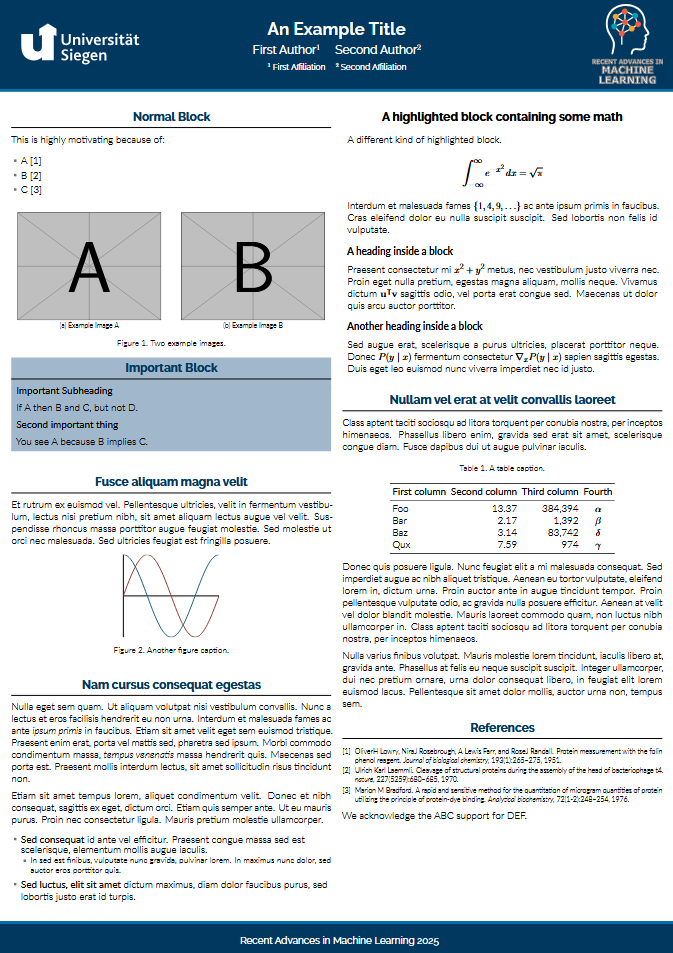

# Latex Template for Posters

This is a LaTeX template for the RAML poster session. It is based on the `beamer` class and the `beamerposter` package. The template is designed to be used with the `lualatex` engine, and can be uploaded to overleaf.
Its adapted to the corporate design of the University of Siegen and based on the unofficial UChicago CS Poster Template.

## Preview

The template approximately looks like this:

## Overleaf Usage

To use this template on Overleaf, you can create a new project and upload the files from this repository. To build the poster, you need to select the `lualatex` engine in the project settings.

## Local Build

To build the template locally, you need to have a LaTeX distribution installed. 
Furthermore VSCode with the LaTeX Workshop extension is recommended.
Follow the installation steps and be sure to have the `lualatex` engine working.

Also some fonts are required. You can install them via the package manager of your LaTeX distribution or download them from the internet.
The fonts which are used in this template are:
- [Railway](https://fonts.google.com/specimen/Raleway)